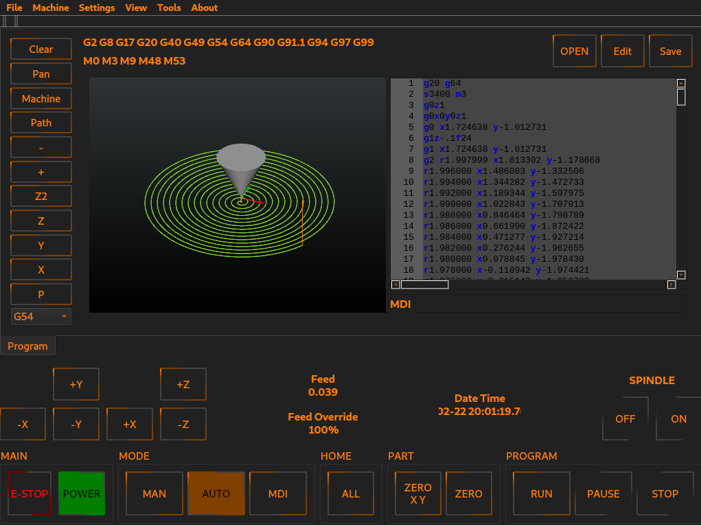

# TurBo NC interface for linuxcnc



TurBo NC is a QtPyVCP based interface for the LinuxCNC machine control.

## Quick install

Install linuxcnc using linuxcnc 2.90~pre

http://www.linuxcnc.org/


* Dependencies

```
$ sudo apt install python3-pyqt5 python3-pyqt5.qtquick python3-venv python3-dbus.mainloop.pyqt5 python3-pyqt5.qtopengl python3-pyqt5.qsci python3-pyqt5.qtmultimedia qml-module-qtquick-controls gstreamer1.0-plugins-bad libqt5multimedia5-plugins pyqt5-dev-tools python3-dev python3-setuptools python3-pip git
```

## Custom Install (Optional)

Clone the tnc repository

```
$ git clone https://github.com/KCJengr/turbonc.git
```

Install TurBoNC using pip

```
$ cd tnc
$ python3 -m venv venv
$ source venv/bin/activate
$ python3 -m pip install -e .
$ qcompile .
```

Now you can run editvcp to edit the interface

```
$ editvcp tcnc
```


## Documentation

QtPyVCP [documentation](https://qtpyvcp.com)


## Resources

* [Development](https://github.com/TurBoss/jauriacnc/)
* [Documentation](https://qtpyvcp.com/)
* [Libera Chat](http://web.libera.chat/) (#qtpyvcp)
* [The Matrix](https://riot.im/app/#/room/#qtpyvcp:matrix.org) (#qtpyvcp:matrix.org)


## Dependencies

* [LinuxCNC](https://linuxcnc.org)
* [QtPyVCP](https://qtpyvcp.com/)
* Python 3.11
* PyQt5 or PySide2

TurBoNC is developed and tested using the LinuxCNC Debian 12 (bookworm)


## DISCLAIMER

THE AUTHORS OF THIS SOFTWARE ACCEPT ABSOLUTELY NO LIABILITY FOR
ANY HARM OR LOSS RESULTING FROM ITS USE.  IT IS _EXTREMELY_ UNWISE
TO RELY ON SOFTWARE ALONE FOR SAFETY.  Any machinery capable of
harming persons must have provisions for completely removing power
from all motors, etc, before persons enter any danger area.  All
machinery must be designed to comply with local and national safety
codes, and the authors of this software can not, and do not, take
any responsibility for such compliance.

This software is released under the GPLv2.
